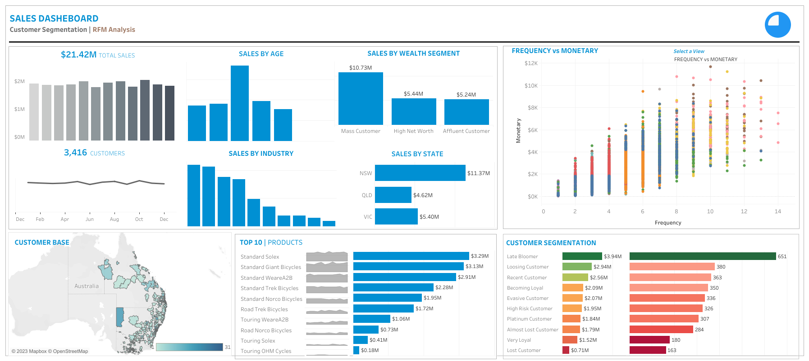

# Data Analytics Customer Segmentation

## Goal of the project
The purpose of this project is to conduct a Customer Segmentation Analysis for an Automobile bike Company. Customer segmentation is performed by developing a RFM Model. RFM (Recency, Frequency, Monetary) analysis is a behavior-based approach grouping customers into segments. It groups the customers on the basis of their previous purchase transactions. In this analysis the customer segment was divided into 11 groups. The analysis will help in determining which customers segments should be targeted in order to enhance sales revenue for the company. A **Sales Dashboard for Customer Segmentation** is developed using **Tableau** and the data quality assessment and analysis is done using **Python**.

## Tableau Dashboard
The Sales Dashboard for Customer Segmentation can be found [here](https://public.tableau.com/app/profile/usama.zafar.qureshi/viz/SalesSegmentation_16916653192370/SalesSegmentation2).

**In case of failure of loading Jupyter Notebooks on Github, the following notebooks can be found in nbviewer. Click on the respective hyperlinks to view:**

+ [DQA and Data Cleaning Customer Address.ipynb](https://nbviewer.org/github/usamaqureshi27/Python/blob/main/DQA_Customer_Address_Cleaned.ipynb)
+ [DQA and Data Cleaning Customer Demographics.ipynb](https://nbviewer.org/github/usamaqureshi27/Python/blob/main/DQA_Customer_Demographics_Cleaned.ipynb)
+ [DQA and Data Cleaning New Customers.ipynb](https://nbviewer.org/github/usamaqureshi27/Python/blob/main/DQA_New_Customers_Cleaned.ipynb)
+ [DQA and Data Cleaning Transactions.ipynb](https://nbviewer.org/github/usamaqureshi27/Python/blob/main/DQA_Transactions_Cleaned.ipynb)
+ [EDA and RFM Analysis](https://nbviewer.org/github/usamaqureshi27/Python/blob/main/EDA_RFM%20Analysis.ipynb)

## Analysis Approach

### 1. Data Quality Assessment and Data Cleaning
The first step towards generating useful insights from the data was the data prepartion, quality assessment and data cleaning step. After the cleaning process exploratory data analysis on the dataset and identification customer purchasing behaviours to generate insights can be performed.

In the data cleaning step the data quality of the following datasets were first assesed. After a data quality assessment the following data quality issues was observed and the necessary process to mitigate the issue was followed :

+ **CustomerDemographics.xlsx :**
  + 1 Irrelevent column was present and such columns were dropped from the dataset.
  + There were 5 columns were Missing values were present. For such columns based on the volumne of the missing values either the records were dropped or appropiate values were imputed at places of missing values.
  + For gender column there was no standardisation of data. Based on the values available the column data was standardised to remove data inconsistency.
  + The Date of Birth column was transformed to create a new feature column 'Age' and 'Age Group' to check for discripency of age distribution. An outlier was observed and the record was removed.
  + Checked whether there are duplicate records present in the dataset. In this dataset there were no duplicate records.
  
+ **NewCustomerList.xlsx :**
  + 5 Irrelevent column was present and such columns were dropped from the dataset.
  + There were 4 columns were Missing values were present. For such columns based on the volumne of the missing values either the records were dropped or appropiate values were imputed at places of missing values.
  + The Date of Birth column was transformed to create a new feature column 'Age' and 'Age Group' to check for discripency of age distribution.
  + There was no data inconsistency.
  + Checked whether there are duplicate records present in the dataset. In this dataset there were no duplicate records.
  
+ **Transaction_data.xlsx :**
  + The product_first_sold_date column is not in datetime format. The data type of this column was changed from int64 to datetime format.
  + There were 7 columns were Missing values were present. For such columns based on the volumne of the missing values either the records were dropped or appropiate values were imputed at places of missing values.
  + A new feature column 'Profit' was created which is basically the difference between list price and standard price.
  + There was no data inconsistency.
  + Checked whether there are duplicate records present in the dataset. In this dataset there were no duplicate records.

+ **CustomerAddress.xlsx :**
  + For states column there was no standardisation of data. Based on the values available the column data was standardised to remove data inconsistency.
  + There were certain customer IDs from Customer Dempgraphics table which were getting dropped in the Address table.
  
### 2. Exploratory Data Analysis on Customer Segments
After the data cleaning process, exploratory analysis on the dataset is performed and the following insights are obtained :
+ New vs Old Customers Age Distribution
  + Most New customers are aged between 40-49 also for Old Customers the most of them are aged between 40-49.
  + The lowest number of customers for both the types of customers is present in the age bracket under 30 and above 70 age groups.
  + The automobile company is popular among New Customers among the age between 40-70.
  + A steep drop in customers is observed in the 30-39 age group among the New Customers.

| Old Customers by Age Distribution | New Customers by Age Distribution |
| :------------- | :------------- |
|||

+ Bike purchases over last 3 years by Gender
  + Most bike puechases are done by Feamale over the last 3 years. Approximately 51% of the bike purchases are done by Female compared to 49% of the purchases being done by Male.
  + The Female purchases are 10,000 more than that of Male purchases (numerically).
  

+ New vs Old Customers Job Industry Distribution
  + Most New customers are from the Manufacturing and Financial Services sector (approx 20% of the New Customers).
  + The lowest number of customers are from the Agriculture and Telecom sector approx 3%.
  + Similar trend is observed among Old Customers as well.

| Old Customers by Job Industry | New Customers by Job Industry |
| :------------- | :------------- |
|||

+ Wealth Segmentation by Age Category
  + Across all age categories the largest number of customers are from 'Mass Customer' Segment.
  + The next category comes from the 'High Net Worth' customers.
  + In the age group 40-49, Affluent segment out performs the High Net Worth customers in terms of number of customers despite old or new customers.

| Old Customers Wealth by Age Group | New Customers Wealth by Age Group |
| :------------- | :------------- |
|||

+ Cars owned by States
  + New South Wales has the largest number of people who don't own a car.
  + In Victoria and Queensland the proportion is quite even.
  + In New South Wales the number of people owning a car is significantly lesser than who donot have a car.

### 1. RFM Analysis and Customer Segmentation
In this stage of analysis the customer segmentation was done by developing an RFM Model. The RFM (Recency, Frequency, Monetary) analysis is a behavior-based approach grouping customers into segments. It groups the customers on the basis of their previous purchase transactions.

In this analysis the customer segment was divided into 11 groups. The groups being :

+ Platinum Customers
+ Very Loyal Customers
+ Recent Customers
+ Potential Customers
+ Lost Customers
+ Losing Customers
+ Late Bloomer
+ High Risk Customers
+ Evasive Customers
+ Becoming Loyal
+ Almost lost Customers

As of the current state of the Automobile business the current distribution of customers segments is depicted below:

## Datasets Used
The datasets used include:
+ **Raw_data.xlsx:** This excel file dataset included the following sheets of data:
  + **Transactions_data.xlsx:** This dataset included the transactions data of the customers across all the different states in Australia.
  + **NewCustomerList.xlsx:** This dataset included the new customers who visted the automobile bike company recently.
  + **CustomerDemographic.xlsx:** This dataset included entire details of the Customer Demographics.
  + **CustomerAddress.xlsx:** This dataset included the address of the Customers.
  
## Tools and Technologies Used
The tools used in this project include:
+ **Python** - This was needed to conduct Data Quality Assessment and also for Data Cleaning processes. With Python libraries **pandas, matplotlib, seaborn** exploratory data analysis of the datasets and to gain useful insights from the data was possible.
+ **Tableau**- This Business Intelligence tool was required to explore data and create charts, graphs, visualizations to come up with a Sales Dashboard for Customer Segmenatation for the automobile bike company.

## Built With
+ Python 3.10.11, Tableau

## Authors
+ Usama Qureshi - [Github Profile](https://github.com/usamaqureshi27)