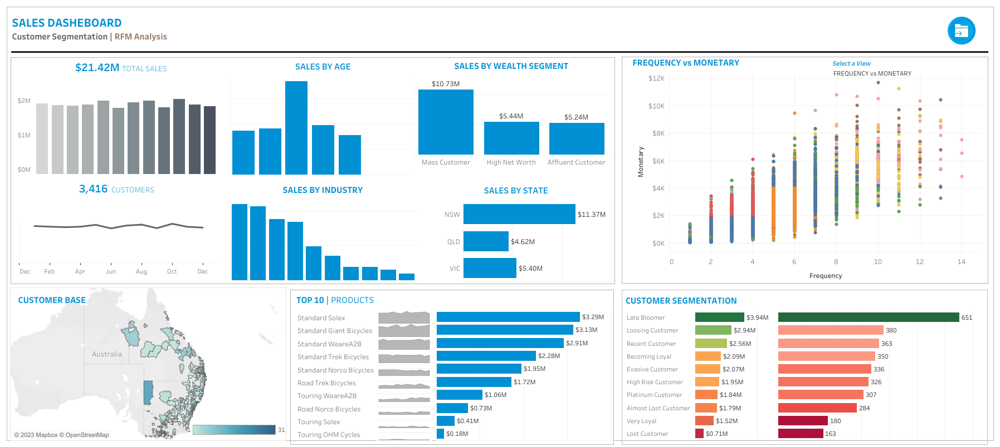

# Data Analytics Customer Segmentation

## Goal of the project
The purpose of this project is to conduct a Customer Segmentation Analysis for an Automobile bike Company. Customer segmentation is performed by developing a RFM Model. RFM (Recency, Frequency, Monetary) analysis is a behavior-based approach grouping customers into segments. It groups the customers on the basis of their previous purchase transactions. In this analysis the customer segment was divided into 11 groups. The analysis will help in determining which customers segments should be targeted in order to enhance sales revenue for the company. A **Sales Dashboard for Customer Segmentation** is developed using **Tableau** and the data quality assessment and analysis is done using **Python**.

## Tableau Dashboard
The Sales Dashboard for Customer Segmentation can be found [here](https://public.tableau.com/app/profile/usama.zafar.qureshi/viz/SalesSegmentation_16916653192370/SalesSegmentation2).

**In case of failure of loading Jupyter Notebooks on Github, the following notebooks can be found in nbviewer. Click on the respective hyperlinks to view:**

+ [DQA and Data Cleaning Customer Address.ipynb](https://nbviewer.org/github/usamaqureshi27/Python/blob/main/DQA_Customer_Address_Cleaned.ipynb)

## Analysis Approach

### 1. Data Quality Assessment and Data Cleaning
The first step towards generating useful insights from the data was the data prepartion, quality assessment and data cleaning step. After the cleaning process exploratory data analysis on the dataset and identification customer purchasing behaviours to generate insights can be performed.

In the data cleaning step the data quality of the following datasets were first assesed. After a data quality assessment the following data quality issues was observed and the necessary process to mitigate the issue was followed :

+ **CustomerDemographics.xlsx :**
  + 1 Irrelevent column was present and such columns were dropped from the dataset.
  + There were 5 columns were Missing values were present. For such columns based on the volumne of the missing values either the records were dropped or appropiate values were imputed at places of missing values.
  + For gender column there was no standardisation of data. Based on the values available the column data was standardised to remove data inconsistency.
  + The Date of Birth column was transformed to create a new feature column 'Age' and 'Age Group' to check for discripency of age distribution. An outlier was observed and the record was removed.
  + Checked whether there are duplicate records present in the dataset. In this dataset there were no duplicate records.
  
+ **NewCustomerList.xlsx :**
  + 5 Irrelevent column was present and such columns were dropped from the dataset.
  + There were 4 columns were Missing values were present. For such columns based on the volumne of the missing values either the records were dropped or appropiate values were imputed at places of missing values.
  + The Date of Birth column was transformed to create a new feature column 'Age' and 'Age Group' to check for discripency of age distribution.
  + There was no data inconsistency.
  + Checked whether there are duplicate records present in the dataset. In this dataset there were no duplicate records.
  
+ **Transaction_data.xlsx :**
  + The product_first_sold_date column is not in datetime format. The data type of this column was changed from int64 to datetime format.
  + There were 7 columns were Missing values were present. For such columns based on the volumne of the missing values either the records were dropped or appropiate values were imputed at places of missing values.
  + A new feature column 'Profit' was created which is basically the difference between list price and standard price.
  + There was no data inconsistency.
  + Checked whether there are duplicate records present in the dataset. In this dataset there were no duplicate records.

+ **CustomerAddress.xlsx :**
  + For states column there was no standardisation of data. Based on the values available the column data was standardised to remove data inconsistency.
  + There were certain customer IDs from Customer Dempgraphics table which were getting dropped in the Address table.
  
### 2. Exploratory Data Analysis on Customer Segments
After the data cleaning process, exploratory analysis on the dataset is performed and the following insights are obtained :
+ New vs Old Customers Age Distribution
  + Most New customers are aged between 40-49 also for Old Customers the most of them are aged between 40-49.
  + The lowest number of customers for both the types of customers is present in the age bracket under 20 and above 80 age groups.
  + The automobile company is popular among New Customers among the age groups 20-29 and 40-49.
  + A steep drop in customers is observed in the 30-39 age group among the New Customers.

| Old Customers by Age Distribution | New Customers by Age Distribution |
| :--------------------- | :---------------------- |
|  |  |
